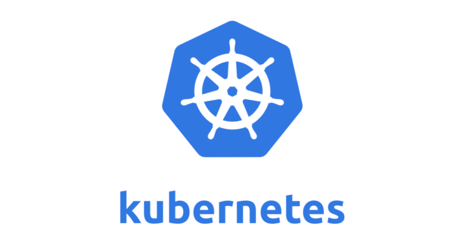

#
개발자라면 적어도 Kubernetes와 Docker에 대해서 알아야 한다.
난 모르니까 지금부터 정리해보자.
#
---
#
## 컨테이너
#
애플리케이션을 실행할 수 있는 환경까지 감싸서, 어디서든 쉽게 실행할 수 있도록 해 주는 기술이다. 만약 컨테이너 없이 배포를 한다면, 배포 서버와 개발 서버의 환경을 일일이 맟춰야한다.
#
 이 때, 컨테이너를 사용할 때 필요한 도구가 컨테이너 런타임이다.

#
## 컨테이너 런타임
#
컨테이너를 쉽게 내려받거나 공유하고 구동할 수 있도록 해주는 도구이다.
그중 가장 유명한 것이 도커이다.
#
## 쿠버네티스
#
컨테이너 런타임을 통해 컨테이너를 다루는 도구이다. 쿠버네티스가 해 주는 일은 여러 서버에 컨테이너를 분산해서 배치하거나, 문제가 생긴 컨테이너를 교체하거나, 컨테이너가 사용할 비밀번호나 환경 설정을 관리하고 주입해 주는 일 등, 이것을 컨테이너 오케스트레이션이라 한다

#
## 쿠버네티스와 도커
#

쿠버네티스의 역할은 컨테이너를 분산 배치, 상태 관리 및 컨테이너의 구동 환경까지 관리해 주는 도구이고, 도커는 컨테이너를 다루는 도구(컨테이너 런타임) 중 하나이다. 
쿠버네티스는 컨테이너를 다루기 위해 도커 이외에도 다양한 컨테이너 런타임 소프트웨어를 사용할 수 있다.

#

---

#
## 전통적 배포
#

#
맨 왼쪽의 Traditional Deployment(전통적 배포)는 가상화 이전부터 쓰이던 방식이다. 물리적인 컴퓨터 한 대에 하나의 OS를 깔고 여러 가지 프로그램을 설치하는 방식이다. 가장 오래되고 단순한 방식이며 단일 목적 시스템이라면 별 무리가 없다.

#
## 전통적 배포의 문제점
#

한 대의 컴퓨터에서 모든 것을 처리하려고 하면 특정 프로그램이 성능을 독점할 경우 또 다른 프로그램의 성능이 떨어지는 단점이 있다

그렇다면 이 문제를 해결하기 위해서는 어떻게 해야 할까?

“인터넷 뱅킹 전용 컴퓨터를 구입해 두 대를 쓰면 되지 않을까?” 이렇게 생각해 볼 수도 있겠지만, 그러기엔 비용이 너무 많이 들게 된다

그렇다면 어떤 식으로 해결할 수 있을지 살펴보자

#
---
#
## 가상화 배포
#

#
이 문제를 해결하기 위해 등장한 해법이 위 그림의 Virtualized Deployment(가상화 배포)이다. 

가상머신(Virtual Machine)을 기반으로 배포를 하는 방법이다. 중간에 위치한 하이퍼바이저는 하나의 시스템 상에서 가상 컴퓨터를 여러 개 구동할 수 있도록 해 주는 중간 계층을 의미한다 

가상머신은 말 그대로 가상 컴퓨터이다. 컴퓨터이기 때문에 가상머신에도 CPU, 메모리, 저장 장치 등을 개별적으로 할당할 수 있다. 

다만 이 방식이 전통적 배포 방식보다는 분명 효율적이지만, 가상머신은 완전한 컴퓨터이고 가상머신에 일일이 운영체제를 설치해야 하기 때문에 컨테이너 중심의 배포(Container Deployment)보다는 무겁다.

#

#

마지막으로 Container Deployment(컨테이너 중심의 배포)에 대해 살펴보자. 

하이퍼바이저라는 부분이 Container Runtime으로 대체되었고, Virtual Machine이라고 된 부분은 Container로 대체가 되었다.

컨테이너는 가상머신과 달리 프로그램 구동을 위해서 OS를 매번 설치할 필요가 없다. 그림에서 보는 것과 같이 OS는 하나만 사용한다.

컨테이너 런타임 위에 OS와 하드웨어가 층으로 쌓여 있는 그림을 보고 전통적인 배포 위에서 컨테이너 런타임을 올렸다고 오해를 하곤 하는데, 컨테이너는 OS 하단이 어떻게 동작하는지 직접 관심을 두지 않는다. 

그래서 가상머신 위에 올라간 OS에서 컨테이너 기반 배포를 하는 것이 가능합니다.

앞에서 게임과 인터넷 뱅킹 프로그램이 한 컴퓨터에 설치된다면, 서로 간섭을 일으켜 성능 저하나 오류를 발생시킬 수 있다고 예시를 들었는데,

지금부터 이 문제를 컨테이너 중심의 배포 방식에서는 어떻게 해결하는지 알아보기 위해 게임과 인터넷 뱅킹 소프트웨어가 각각 컨테이너로 배포된다고 가정해보자(물론 이럴 일은 없겠지만)

이때 게임과 인터넷 뱅킹은 하나의 OS 상에서 구동됩니다. 이것만 보면 전통적 배포에서 하나의 OS 위에 프로그램을 여러 개 구동시킨 것과 별 차이가 없어보안더. 그렇지만 컨테이너 중심의 배포는 여기서 중요한 기술적인 차이점이 하나 있다. 

게임과 인터넷 뱅킹이 각각 실행되면서 ‘이 컴퓨터에서 나만 구동되고 있다’라고 판단할 수 있도록, 실제로 두 프로그램 간에 간섭을 일으킬 수 없는 장벽을 친다. 이러한 장벽을 치는 것과 동시에 OS는 게임과 인터넷 뱅킹이 사용할 수 있는 CPU, 메모리 등의 자원 또한 독립적으로 사용할 수 있도록 할당하고 관리한다. 

이러한 과정을 통해 게임과 인터넷 프로그램은 스스로를 ‘서로 다른 컴퓨터에서 깔려 있다’고 생각하게 된다. 물론 OS의 관점에서 보자면 둘 다 OS 상에서 구동되는 프로그램이지만 말이죠. 이와 같은 컨테이너 동작 방식을 OS 커널을 공유하는 가상화라고 표현하기도 한다.

이때 주의할 점이 하나 있다. 컨테이너는 OS를 공유하는 방식이기 때문에, 어떤 프로그램의 문제가 다른 프로그램을 간섭할 수는 없다. 그러나 내 프로그램의 문제가 OS에 문제를 일으킬 경우에는 OS에서 구동 중인 전체 컨테이너의 문제가 될 가능성이 있다. 우리는 이 점에 신경을 써야 한다.

지금 말씀드린 기술에 대해 자세하게 설명하지는 않을게요. 다만, 리눅스를 기준으로 내가 실행한 프로그램이 독립된 환경에서 실행되는 것처럼 격리시켜주고, CPU, 메모리 및 저장 장치와 같은 자원도 실행한 프로그램이 독립적으로 쓸 수 있도록 해주는 namespace 및 cgroup이라는 기술이 있다는 것만 알아 두면 된다!

