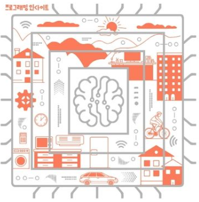

#


#
### include 폴더 생성
#
```bash
mkdir include
cd include
vi MemoryMap.h
```
#
_MemoryMap.h_
```c
#define INST_ADDR_START         0
#define USRSYS_STACK_START      0x00100000
#define SVC_STACK_START         0x00300000
#define IRQ_STACK_START         0x00400000
#define FIQ_STACK_START         0x00500000
#define ABT_STACK_START         0x00600000
#define UND_STACK_START         0x00700000
#define TASK_STACK_START        0x00800000
#define GLOBAL_ADDR_START       0x04800000
#define DALLOC_ADDR_START       0x04900000

#define INST_MEM_SIZE           (USRSYS_STACK_START-INST_ADDR_START)
#define USRSYS_STACK_SIZE       (SVC_STACK_START-USRSYS_STACK_START)
#define SVC_STACK_SIZE         (IRQ_STACK_START-SVC_STACK_START)
#define IRQ_STACK_SIZE         (FIQ_STACK_START-IRQ_STACK_START)
#define FIQ_STACK_SIZE         (ABT_STACK_START-FIQ_STACK_START)
#define ABT_STACK_SIZE         (UND_STACK_START-ABT_STACK_START)
#define UND_STACK_SIZE         (TASK_STACK_START-UND_STACK_START)
#define TASK_STACK_SIZE        (GLOBAL_ADDR_START-TASK_STACK_START)
#define GLOBAL_ADDR_SIZE       (DALLOC_ADDR_START-GLOBAL_ADDR_START)
#define DALLOC_ADDR_SIZE       (55*1024*1024)

#define USRSYS_STACK_TOP        (USRSYS_STACK_START+USRSYS_STACK_SIZE-4)
#define SVC_STACK_TOP           (SVC_STACK_START+SVC_STACK_SIZE-4)
#define IRQ_STACK_TOP           (IRQ_STACK_START+IRQ_STACK_SIZE-4)
#define FIQ_STACK_TOP           (FIQ_STACK_START+FIQ_STACK_SIZE-4)
#define ABT_STACK_TOP           (ABT_STACK_START+ABT_STACK_SIZE-4)
#define UND_STACK_TOP           (UND_STACK_START+UND_STACK_SIZE-4)
```
#
_ARMv7AR.h_
```c
#define ARM_MODE_BIT_USR 0x10
#define ARM_MODE_BIT_FIQ 0x11
#define ARM_MODE_BIT_IRQ 0x12
#define ARM_MODE_BIT_SVC 0x13
#define ARM_MODE_BIT_ABT 0x17
#define ARM_MODE_BIT_UND 0x1B
#define ARM_MODE_BIT_SYS 0x1F
#define ARM_MODE_BIT_MON 0x16
```
#
MemoryMap.h와 ARMv7AR.h는 C언어 헤더 파일이다. GCC로 컴파일 할 경우 asm 파일에서도 사용할 수 있다. Entry.S에서 사용하기 위해 헤더를 추가해 준다.
#
```c
#include "ARMv7AR.h"
#include "MemoryMap.h"

.text
    .code 32

    .global vector_start
    .global vector_end

    vector_start:
        LDR PC, reset_handler_addr
        LDR PC, undef_handler_addr
        LDR PC, svc_handler_addr
        LDR PC, pftch_abt_handler_addr
        LDR PC, data_abt_handler_addr
        B .
        LDR PC, irq_handler_addr
        LDR PC, fiq_handler_addr

        reset_handler_addr:     .word reset_handler
        undef_handler_addr:     .word dummy_handler
        svc_handler_addr:       .word dummy_handler
        pftch_abt_handler_addr: .word dummy_handler
        data_abt_handler_addr:  .word dummy_handler
        irq_handler_addr:       .word dummy_handler
        fiq_handler_addr:       .word dummy_handler
    vector_end:

    reset_handler:
        MRS R0, CPSR
        BIC R1, R0, #0x1F
        ORR R1, R1, #ARM_MODE_BIT_SVC
        MSR CPSR, R1
        LDR SP, =SVC_STACK_TOP
        
        MRS R0, CPSR
        BIC R1, R0, #0x1F
        ORR R1, R1, #ARM_MODE_BIT_IRQ
        MSR CPSR, R1
        LDR SP, =IRQ_STACK_TOP

        MRS R0, CPSR
        BIC R1, R0, #0x1F
        ORR R1, R1, #ARM_MODE_BIT_FIQ
        MSR CPSR, R1
        LDR SP, =FIQ_STACK_TOP

        MRS R0, CPSR
        BIC R1, R0, #0x1F
        ORR R1, R1, #ARM_MODE_BIT_ABT
        MSR CPSR, R1
        LDR SP, =ABT_STACK_TOP

        MRS R0, CPSR
        BIC R1, R0, #0x1F
        ORR R1, R1, #ARM_MODE_BIT_UND
        MSR CPSR, R1
        LDR SP, =UND_STACK_TOP

        MRS R0, CPSR
        BIC R1, R0, #0x1F
        ORR R1, R1, #ARM_MODE_BIT_SYS
        MSR CPSR, R1
        LDR SP, =USRSYS_STACK_TOP

    dummy_handler:
        B .
.end
```
#
위의 코드는 .h 파일 두개를 추가 후 SP 설정 및 초기화를 위해 reset_handler 부분을 수정한 것이다. 모든 동작 모드를 한 번씩 순회하면서 스택 꼭대기 메모리 주소를 SP에 설정하는 코드이다. 

SP에 해당모드의 시작 주소를 넣는 것이 아닌 TOP의 주소를 넣는 것은 스택이 높은 주소에서 낮은 주소로 자라는 특징을 가지고 있기 때문이다.( 하지만 이것은 설계자 마음이다. 꼭 Stack이 위에서 아래로 heap은 밑에서 위로 자라는 방향은 아니다.) 
#
_Makefile_
```Makefile
ARCH = armv7-a
MCPU = cortex-a8

CC = arm-none-eabi-gcc
AS = arm-none-eabi-as
LD = arm-none-eabi-ld
OC = arm-none-eabi-objcopy

LINK_SCRIPT = ./navilos.ld

ASM_SRCS = $(wildcard boot/*.S)
ASM_OBJS = $(patsubst boot/%.S, build/%.o, $(ASM_SRCS))

INC_DIRS = include

navilos = build/navilos.axf
navilos_bin = build/navilos.bin

.PHONY: all clean run debug gdb

all: $(navilos)

clean:
	@rm -fr build

run: $(nvailos)
	@qemu-system-arm -M realview-pb-a8 -kernel $(navilos)

debug: $(nvailos)
	@qemu-system-arm -M realview-pb-a8 -kernel $(navilos) -S -gdb tcp::1234,ipv4

gdb:
	arm-none-eabi-gdb

$(navilos): $(ASM_OBJS) $(LINK_SCRIPT)
	$(LD) -n -T $(LINK_SCRIPT) -o $(navilos) $(ASM_OBJS)
	$(OC) -O binary $(navilos) $(navilos_bin)

build/%.o: boot/%.S
	mkdir -p $(shell dirname $@)
	$(CC) -march=$(ARCH) -mcpu=$(MCPU) -I $(INC_DIRS) -c -g -o $@ $<
```
#
ASM 컴파일러를 산용해서 컴파일 할 경우 전처리기가 없기 때문에 .h파일을 읽어올 수 없다. 따라서, 컴파일러를 gcc로 변경한다. 추가적으로 .h 파일들이 존재하는 include 디렉토리도 추가한다. 위의 makefile 내용으로 수정한다.
#
{:width="600"}
#
make all을 수행한 결과이다. 이후 QEMU <-> gdb를 이용해 sp의 메모리 위치를 확인해 보자.
#
{:width="600"}
#
34번째 라인까지 실행되고 첫번째 SVC 동작 모드 스택이 설정된다. SVC 모드 스택은 0x00300000 ~ 0x003FFFFF까지 메모리 주소 영역이다. 스택과 스택 경계에 4B를 비워두도록 크기를 설정 했으므로 0x003FFFFC여야 한다. 위 그림의 info register 결과에서 볼수 있듯이 sp의 값이 해당 값을 가리키고 있음을 알수 있다.
#
CPSR을 보면 마지막 바이트가 0xd3이다. 이것은 11010011(2)이며, 마지막 하위 5비트만 보면 10011이다. 이것은 16진수로 0x13을 나타낸다. SVC 동작 모드를 설정하는 값이다. 
#
{:width="600"}
#
ARM의 CPSR 레지스터의 bit 필드를 나타낸다. 하위 5bit는 해당 모드의 동작 상태를 나타내며 0b10011은 SVC를 나타낸다.  이렇게 모든 모드들에 대해서 sp를 정해 준다. 실제 보드에서는 sp뿐만이 아닌 하드웨어 시스템 클럭 설정, 메모리 컨트롤러 초기화 같은 일들도 필요하다. 이것은 추후에 Cortex-M3를 공부하며 진행하도록 하겠다.
#
_Entry.S 부분_
```c
...

MRS R0, CPSR
BIC R1, R0, #0x1F
ORR R1, R1, #ARM_MODE_BIT_SYS
MSR CPSR, R1
LDR SP, =USRSYS_STACK_TOP
BL main
```
#
BL main을 추가해준다. 이것을 통해 asm의 동작이 끝난후 C언어의 main문으로 함수가 점프하게 된다. 
#
_build/Mainc.C를 생성 후 아래 내용 입력_
```c
#include "stdint.h"

void main(void)
{
    uint32_t* dummyAddr = (uint32_t*)(1024*1024*100);
    *dummyAddr =  sizeof(long);
}
```
#
BL 브랜치 명령으로 점프 하려면 점프 대상 레이블이 같은 파일 안에 있어야 한다. 다른 파일에 있다면 링커가 링킹할 수 있도록 레이블을 .global로 선언해야 한다. 컴파일러는 C언어 함수 이름을 링커가 자동으로 접근할 수 있는 전역 심벌로 만든다. 전역 심볼은 어셈블리로 사용할떄 .global 지시어로 선언하고 C언어로 할때는 extern으로 사용한다.  반대로 어셈블리에서 .global로 선언한 이름은 c언어에서 함수 호출로 진입할 수 있다.
#
새롭게 Make 파일을 수정해 준다.
```Makefile
ARCH = armv7-a
MCPU = cortex-a8

CC = arm-none-eabi-gcc
AS = arm-none-eabi-as
LD = arm-none-eabi-ld
OC = arm-none-eabi-objcopy

LINKER_SCRIPT = ./navilos.ld
MAP_FILE = build/navilos.map

ASM_SRCS = $(wildcard boot/*.S)
ASM_OBJS = $(patsubst boot/%.S, build/%.os, $(ASM_SRCS))

C_SRCS = $(wildcard boot/*.c)
C_OBJS = $(patsubst boot/%.c, build/%.o, $(C_SRCS))

INC_DIRS  = -I include

navilos = build/navilos.axf
navilos_bin = build/navilos.bin

.PHONY: all clean run debug gdb

all: $(navilos)

clean:
	@rm -fr build
	
run: $(navilos)
	qemu-system-arm -M realview-pb-a8 -kernel $(navilos)
	
debug: $(navilos)
	qemu-system-arm -M realview-pb-a8 -kernel $(navilos) -S -gdb tcp::1234,ipv4
	
gdb:
	arm-none-eabi-gdb
	
$(navilos): $(ASM_OBJS) $(C_OBJS) $(LINKER_SCRIPT)
	$(LD) -n -T $(LINKER_SCRIPT) -o $(navilos) $(ASM_OBJS) $(C_OBJS) -Map=$(MAP_FILE)
	$(OC) -O binary $(navilos) $(navilos_bin)
	
build/%.os: $(ASM_SRCS)
	mkdir -p $(shell dirname $@)
	$(CC) -march=$(ARCH) -mcpu=$(MCPU) $(INC_DIRS) -c -g -o $@ $<
    
build/%.o: $(C_SRCS)
	mkdir -p $(shell dirname $@)
	$(CC) -march=$(ARCH) -mcpu=$(MCPU) $(INC_DIRS) -c -g -o $@ $<
```
#
{:width="600"}
#
make all 수행후 gdb를 통해 실행파일을 run한 후 정지 시키자. 그럼 펌웨어가 main() 함수를 실행하고 나면 다시 reset handler로 돌아가서 무한루프는 도는 것을 확인할 수 있다. 그래서 '컨트롤+c' 명령을 입력하기 전까진 종료되지 않는다. 

이후 x/8wx 메모리 주소 명령을 입력한다. 이 명령은 입력된 메모리 주소부터 8개를 4바이트씩 16진수로 값을 출력하라는 명령이다. 그래서 0x6400000 메모리 주소의 값을 4바이트씩 8개 출력을한다. 출력 값은 4가 나온다. 
