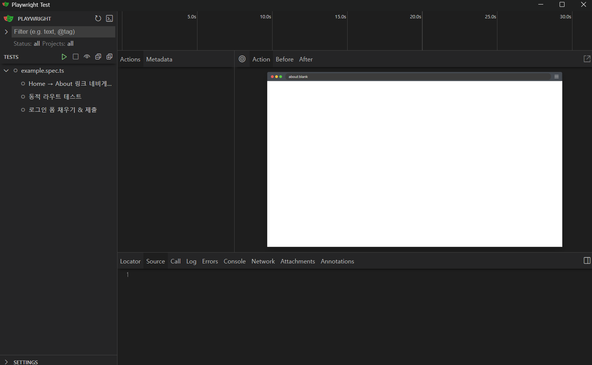

#

>⚠️ 이 블로그는 다른 사람이 보고 따라하라고 적은 게 아닌 작성자의 복기만을 위한 블로그입니다
#
아직 테스트를 도입 할 정도로 대규모 서비스를 구축해본적은 없지만 테스트를 공부해봅시다
#
---
#
## Playwright와 Jest의 차이점
#
1. 목적
    - Jest : 단위 및 통합 테스트에 최적화된 프레임워크
    - Playwright: 실제 브라우저(Chromium, Firefox, WebKit)를 자동화해 E2E 테스트를 수행하는 도구
2. 테스트 실행 환경
    - Jest: jsdom 기반의 가상 DOM 환경에서 빠르게 동작하며, 컴포넌트 로직·함수 검증에 적합합니다 
    - Playwright: headless, headed 모드로 실제 브라우저를 띄워 UI 상호작용·네트워크 요청·반응형 레이아웃 등을 그대로 검사합니다
#
---
#
## Playwright 예제 코드 
#
1. app/**e2e** 폴더를 생성
2. example.spec.ts 파일 생성
3. 아래와 같이 코드 작성
#
```js
import { test, expect } from '@playwright/test';

test('Home → About 링크 네비게이션', async ({ page }) => {
    await page.goto('http://localhost:3000/');
    await page.click('text=About');                                     
    await expect(page).toHaveURL('http://localhost:3000/about');      
});

test('동적 라우트 테스트', async ({ page }) => {
    await page.goto('http://localhost:3000/posts/123');
    await expect(page.locator('h1')).toContainText('Post 123'); 
});

test('로그인 폼 채우기 & 제출', async ({ page }) => {
    await page.goto('http://localhost:3000/login');
    await page.fill('#username', 'testuser');                        
    await page.fill('#password', 'P@ssw0rd!');
    await page.click('button[type="submit"]');
    await expect(page).toHaveURL('http://localhost:3000/dashboard');
});
```
#
### 실행 명령어
#
UI 모드 : 

```bash
npx playwright test --ui
```

#
CLI 모드 : 

```bash
npx playwright test
```

#

잘 뜨는 걸 볼 수 있다.

#
---
#
## Jest 예제 코드
#
1. **/\_\_test\_\_** 폴더 생성
2. Home.test.tsx 파일 생성
3. 아래와 같이 코드 작성
#
```js
import { render, screen } from '@testing-library/react';
import HomePage from '../app/page';

describe('HomePage 컴포넌트', () => {
  it('제목이 렌더링된다', () => {
    render(<HomePage />);
    const heading = screen.getByRole('heading', { level: 1 });
    expect(heading).toHaveTextContent('Home Page');
  });

  it('About 링크가 있고 올바른 경로로 연결된다', () => {
    render(<HomePage />);
    const aboutLink = screen.getByRole('link', { name: 'About' });
    expect(aboutLink).toBeInTheDocument();
    expect(aboutLink).toHaveAttribute('href', '/about');
  });

  it('UI가 이전과 동일한지 스냅샷 테스트', () => {
    const { container } = render(<HomePage />);
    expect(container).toMatchSnapshot();
  });
});
```
#
### 실행 명령어
#
```bash
npm run test:unit 
```
#
### ⚠️ 버그 발생
#

```bash
:\Users\gyumin\Documents\GitHub\playground-nextjs\my-app>npm run test:e2e

> my-app@0.1.0 test:e2e
> playwright test

ReferenceError: describe is not defined

   at __tests__\Home.test.tsx:4

  2 | import HomePage from '../app/page';
  3 |
> 4 | describe('HomePage 컴포넌트', () => {
    | ^
  5 |   it('제목이 렌더링된다', () => {
  6 |     render(<HomePage />);
  7 |     const heading = screen.getByRole('heading', { level: 1 });
    at Object.<anonymous> (C:\Users\gyumin\Documents\GitHub\playground-nextjs\my-app\__tests__\Home.test.tsx:4:1)
ReferenceError: jest is not defined

   at __tests__\Login.test.tsx:6

  4 |
  5 | // next/navigation의 useRouter를 mock 처리
> 6 | jest.mock('next/navigation', () => ({
    | ^
  7 |   useRouter: jest.fn(),
  8 | }));
  9 |
    at Object.<anonymous> (C:\Users\gyumin\Documents\GitHub\playground-nextjs\my-app\__tests__\Login.test.tsx:6:1)


C:\Users\gyumin\Documents\GitHub\playground-nextjs\my-app>npx playwright test
ReferenceError: describe is not defined

   at __tests__\Home.test.tsx:4

  2 | import HomePage from '../app/page';
  3 |
> 4 | describe('HomePage 컴포넌트', () => {
    | ^
  5 |   it('제목이 렌더링된다', () => {
  6 |     render(<HomePage />);
  7 |     const heading = screen.getByRole('heading', { level: 1 });
    at Object.<anonymous> (C:\Users\gyumin\Documents\GitHub\playground-nextjs\my-app\__tests__\Home.test.tsx:4:1)
ReferenceError: jest is not defined

   at __tests__\Login.test.tsx:6

  4 |
  5 | // next/navigation의 useRouter를 mock 처리
> 6 | jest.mock('next/navigation', () => ({
    | ^
  7 |   useRouter: jest.fn(),
  8 | }));
  9 |
    at Object.<anonymous> (C:\Users\gyumin\Documents\GitHub\playground-nextjs\my-app\__tests__\Login.test.tsx:6:1)


C:\Users\gyumin\Documents\GitHub\playground-nextjs\my-app
```
Jest와 Playwright를 함께 쓴다면 XX.**test**.tsx 부분이 겹쳐서 에러가 날 수 있다
#
그러므로 config 파일에서 Jest 폴더와 Playwright 폴더를 따로 지정해줘야 한다