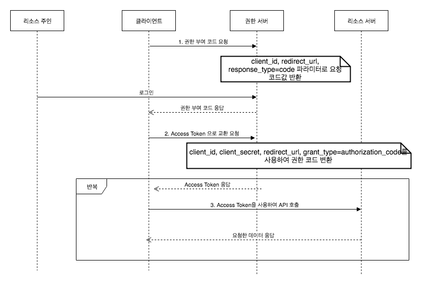

#

>⚠️ 이 블로그는 다른 사람이 보고 따라하라고 적은 게 아닌 작성자의 복기만을 위한 블로그입니다
#
OAuth는 참 편리하지만, 사용하기 위해 알아야 할 지식이 많습니다. 그걸 전부 정리해보겠습니다
#
---
#
## OAuth란 무엇인가?
#
- OAuth는 인터넷 서비스 간에 비밀번호를 공유하지 않고 안전하게 권한을 위임할 수 있도록 만든 개방형 표준 프로토콜입니다 
- 사용자는 계정 비밀번호를 알려주지 않고도 제3자 앱이 자신의 프로필을 조회하거나 게시물을 올릴 수 있게 허용할 수 있습니다 
- OAuth는 이때 “엑세스 토큰”이라는 짧은 수명 권한 증명만을 주고받아, 실제 비밀번호 노출 없이 필요한 범위만 접근하도록 보장합니다 
#
---
#
## 주요 용어 
#
1. Resource Owner (자원 소유자) : 실제 사용자
2. Client (클라이언트) : 앱이나 서비스
3. Authorization Server (인가 서버) : 권한을 확인하고 토큰을 발급하는 서버
4. Resource Server (자원 서버) : 실제 데이터를 보관하는 서버
#
---
#
## 네 가지 권한 부여 방식 (Grant Type)
#
### Authorization Code Grant

#


#
   - 순서 : 클라이언트 → 인가 서버 → 자원 서버
   - 처리 위치: 프론트엔드 + 백엔드 협력
   - 장점
     - 액세스 토큰을 서버 사이드에서 안전하게 관리
     - 리프레시 토큰 사용으로 장기간 세션 유지 가능
   - 단점
     - 인가 코드 교환 단계를 거쳐 구현이 다소 복잡
     - 요청·응답이 많아져 사용자 경험이 약간 저하될 수 있음
#
### Implicit Grant
#


#
   - 순서: 클라이언트 → 자원 서버
   - 처리 위치: 프론트엔드 전용
   - 장점:
     - 서버 코드 없이 클라이언트 측에서 바로 토큰 수신 가능
     - 구현 및 실행이 매우 간단
   - 단점:
     - 토큰이 URL에 노출되어 보안 취약
     - 리프레시 토큰을 받지 못해 토큰 만료 시 재로그인이 필요
#
### Resource Owner Password Credentials (ROPC) Grant
#


#
   - 방식: 사용자명과 비밀번호를 직접 제공
   - 처리 위치: 프론트엔드 전용
   - 장점:
     - 로그인 폼만 있으면 바로 토큰 요청 가능
     - 구현이 매우 직관적이고 단순
   - 단점:
     - 클라이언트가 사용자의 비밀번호를 직접 다루어야 하므로 보안 위험 큼
     - 최신 보안 권고에서 사용 금지 권장
#
### Client Credentials Grant
#


#
   - 방식: 서버 간 통신
   - 처리 위치: 백엔드 전용
   - 장점
     - 머신 대 머신 통신에 간단하고 안전
     - 사용자 개입 없이 애플리케이션 자체 권한으로 토큰 발급
   - 단점
     - 사용자별 권한을 다룰 수 없어, 사용자 로그인에는 적합하지 않음
#
> 정리:
>
> - Implicit, Password → 프론트단만
> - Client Credentials → 백엔드단만
> - Authorization Code → 프론트,백엔드 협력.
#
---
#
## 초보자가 자주 만나는 오류 & 해결법
#
#### CORS 에러
   - 원인: `React localhost:3000` → `API localhost:8000` 요청 시 브라우저가 도메인이 다르다고 차단
   - 해결: 백엔드에서 `Access-Control-Allow-Origin` 헤더 허용하거나, 프록시 설정을 통해 같은 출처로 보이게 설정
#
#### redirect_uri_mismatch
   - 원인: OAuth 제공자 설정의 리디렉트 URI와 요청 URI가 1:1로 일치하지 않음
   - 해결: 프로토콜, 도메인, 포트, 경로까지 완벽히 동일하게 등록·전달
#
#### invalid_client
   - 원인: 잘못된 Client ID/Secret- 사용 시 발생
   - 해결: 발급받은 값을 환경변수나 설정 파일에 오타 없이- 정확히 입력
#
#### 토큰 만료 (invalid_token)
   - 원인: 액세스 토큰 유효기간 경과 시 `401 Unauthorized` 반환
   - 해결: 리프레시 토큰(`grant_type=refresh_token`)으로 새 액세스 토큰 발급, 없으면 다시 로그인

#
---
#
## FastAPI + React로 구현 흐름
#
#### 1. React → Google 인증 페이지로 이동
#
```javascript
function handleGoogleLogin() {
   const clientId = "YOUR_CLIENT_ID";
   const redirectUri = "http://localhost:8000/auth/google/callback";
   window.location.href =
   `https://accounts.google.com/o/oauth2/v2/auth?` +
   `client_id=${clientId}` +
   `&redirect_uri=${encodeURIComponent(redirectUri)}` +
   `&response_type=code&scope=openid%20email%20profile`;
}
```
#
#### 2. Google → FastAPI에 인가 코드 전송
   - 사용자가 동의 후, `http://localhost:8000/auth/google/callback?code=ABC123`로 리디렉션됩니다.
#### 3. FastAPI에서 코드 → 토큰 교환
#
```python
from fastapi import FastAPI, Request
import requests

app = FastAPI()

@app.get("/auth/google/callback")
def google_callback(request: Request):
      code = request.query_params.get("code")
      token_resp = requests.post(
         "https://oauth2.googleapis.com/token",
         data={
            "code": code,
            "client_id": "YOUR_CLIENT_ID",
            "client_secret": "YOUR_CLIENT_SECRET",
            "redirect_uri": "http://localhost:8000/auth/google/callback",
            "grant_type": "authorization_code",
         }
      )
      tokens = token_resp.json()
      return tokens
```
#### 4. FastAPI → Resource Server(구글)에서 사용자 정보 조회
#
```python
user_info = requests.get(
      "https://openidconnect.googleapis.com/v1/userinfo",
      headers={"Authorization": f"Bearer {tokens['access_token']}"}
).json()
```
#
#### 5. React에 로그인 결과 전달
   - FastAPI가 사용자 정보를 JSON으로 반환하면, React는 이를 받아 화면에 표시하거나 상태 관리에 활용합니다.
#