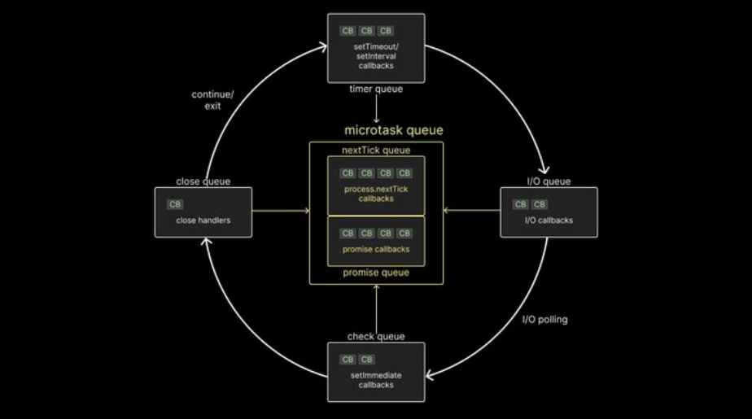

#

>⚠️ 이 블로그는 다른 사람이 보고 따라하라고 적은 게 아닌 작성자의 복기만을 위한 블로그입니다
#
js는 생각보다 좋은 언어입니다. 좋은 언어를 좋게 쓰기 위해 공부해봅시다
#
---
#
## 스코프
#
스코프는 변수의 유효 범위를 지정합니다
#
| 키워드        | 스코프             |
|-|------------------|
| `var`          | 함수 단위 스코프     |
| `let`, `const` | 블록 스코프         |

#
```js
// 블록 안에 변수를 선언해서 밖에서 호출 불가
{ let x = 1; } console.log(x); // error

// 함수 스코프라 사라지지 않음
{ var y = 1; } console.log(y); // 1
```
#
메모리 관리에 유용한 let/const를 쓰는 것이 요즘? 트렌드입니다
#
---
#
## 클로저
#
함수가 선언될 당시의 렉시컬 환경(변수 환경)을 기억하는 특성입니다
#
```js
// x=5
function makeAdder(x) {
    // y=2
    return function (y) {
        // 5 + 2 = 7
        return x + y
    }
}
const addFive = makeAdder(5); // x가 5로 저장됨
console.log(addFive(2)); // y가 2로 들어가면서 7이 반횐됨
```
#
클로저를 활용하면 외부 변수를 안전하게 은닉하거나 데이터 캡슐화에 사용할 수 있습니다
#
#### 클로저를 잘못 사용하는 경우
#
반복문 내에 var로 함수를 생성하는 경우가 있습니다
#
```js
// 잘못된 예: 모든 onfocus 핸들러가 동일한 msg 값을 참조함
for (var i = 0; i < fields.length; i++) {
    // helpText 배열에서 현재 인덱스 i에 해당하는 안내 문구를 msg에 저장
    var msg = helpText[i];
    // 각 필드에 포커스가 생겼을 때 실행될 함수를 등록
    fields[i].onfocus = function() {
        // 포커스 시 msg 값을 콘솔에 출력
        // 하지만 함수 스코프와 클로저 때문에
        // 실제로는 마지막 루프에서 할당된 msg만 출력됨
        console.log(msg);
    };
}

```
#
console.log(msg); <<- 이게 string 값이 아니라 msg 변수를 저장해서 msg가 바뀔때마다, console.log의 값이 바뀐다

> ⚠️ 아니였다!
> #
> **올바른 이해**
> #
> console.log는 변수가 아니라 변수의 값을 그 순간 평가해 출력합니다 
> 다만 문제의 본질은 console.log가 아니라, 클로저가 동일한 msg 변수를 참조하고 있다는 점입니다 
> 따라서 msg를 각각의 반복마다 독립적으로 유지하려면 let/const를 사용하거나 IIFE를 도입해야 합니다 

#
```js
// 올바른 예: let을 사용하면 각 반복마다 새로운 msg를 가짐
for (let i = 0; i < fields.length; i++) {
    let msg = helpText[i];
    fields[i].onfocus = function() {
       console.log(msg);
    };
}
```
#
---
#
## this 바인딩
#
this 바인딩은 함수 호출 방식에 따라 달라진다
#
일단 함수는 전역(window) 또는 언어 환경에 따라 this가 결정되지만
#
객체 메서드로 호출하면 해당 객체를 가리킨다.
#
new로 생성된 함수의 경우 새 객체를 가리키고
#
call / apply로 호출 시 명시적으로 바인딩 할 수 있다
#
```js
const obj = {
    name: "Alice",
    greet: function() { console.log(this.name); },
    arrowGreet: () => { console.log(this.name); }
};
obj.greet(); // "Alice" (obj가 this)
obj.arrowGreet(); // undefined (전역 this)
```
> 😶‍🌫️ 이게 제일 신기했다. 
> #
> 이런거까지 신경써야해!!!!!!!!
> <del>근데 next.js 쓸 때 obj 쓴 기억이 없다. this도 쓴 기억이 없다. 흠..</del>
#
---
#
## 프로토타입과 객체지향 프로그래밍
#
자바스크립트는 프로토타입 기반 객체지향 언어이다. 모든 객체는 내부적으로 다른 객체를 가리키는 프로토타입 링크 \(\[\[Prototype\]\]\) 를 갖는다.
#
객체의 속성을 조회할 때 해당 속성이 없으면 이 프로토타입 체인을 따라 상위 객체에서 찾게된다. 
#
예를 들어, `obj.__proto__`로 상위 객체에 접근하며, 최종적으로 `null`에 도달한다. 
#
이 덕분에 메서드를 공유하거나 상속할 수 있다.
#
```js
function Person(name) {
    this.name = name;
}
Person.prototype.greet = function() {
    console.log(`Hello, ${this.name}!`);
};
const alice = new Person("Alice");
alice.greet(); // "Hello, Alice!"
```
#
위 코드에서 `alice` 객체는 `Person.prototype` 을 가리키며 `greet` 메서드를 상속받아 사용한다.
#
ES6같은 최신 JS에서는 프로토타입 보다 class를 사용하는 것을 권장한다. 내부적으로 둘의 동작방식은 똑같지만, 객체지향 설계를 따라가기 위해선 어쩔 수 없다
#
```js
class PersonClass {
    constructor(name) 
    { 
        this.name = name; 
    }
    greet() 
    { 
        console.log(`Hi, ${this.name}!`); 
    }
}
const bob = new PersonClass("Bob");
bob.greet(); // Hi, Bob!
```
#
이처럼 클래스는 익숙한 구조를 제공하지만, 내부적으로는 여전히 프로토타입 링크 방식으로 동작한다. 
#
따라서 상속을 구현할 때도 Child.prototype = Object.create(Parent.prototype) 와 같은 프로토타입 활용이나 class extends 키워드를 사용할 수 있다.
#
> 문법적 설탕이라는데, 번역을 너무 못한 거 같다.
#
---
#
## 함수형 프로그래밍 기법
#
자바스크립트는 first-class 언어(함수를 변수와 동일하게 다루는 언어)이다.
#
함수를 값처럼 변수에 할당하고 인자로 전달하거나 반환할 수 있다
#
이런 특성으로 고차 함수 패턴을 쉽게 구현할 수 있다. 
#
예를 들어, 배열 처리에 흔히 사용되는 `map`, `filter`, `reduce` 는 모두 고차 함수다.
#
불변성을 중시하여 원본 데이터를 직접 변경하지 않고 새로운 값을 반환하는 방식이 권장된다.
#
예를 들어 원본 배열을 직접 수정하지 않고 `map`을 사용하면 새 배열이 반환된다
#
```js
const arr = [1, 2, 3];
const doubled = arr.map(x => x * 2);
console.log(arr, doubled);
```
#
함수형 프로그래밍에서는 순수 함수를 많이 활용한다. 순수 함수는 동일한 입력에 대해 항상 같은 출력을 반환하며, 함수 외부의 상태를 변경하지 않는다. 
#
예를 들어 덧셈 함수는 외부에 영향을 주지 않으면서 결과만 반환하므로 순수 함수다. 반면, 외부 변수에 의존핟거나 조작하는 함수는 순수하지 않다.
#
```js
// 순수 함수 예제
function add(a, b) {
    return a + b;
}
// 비순수 함수 예제
let counter = 0;
function increment() {
    return ++counter; // 외부 변수 상태를 변경
}

```
#
순수 함수와 불변성을 지키면 코드의 예측 가능성이 높아지고 테스트가 용이해진다. 예를 들어 리덕스 같은 상태 관리 라이브러리는 상태 변경을 순수 함수로 처리하여 버그를 줄인다. 
#
- 고차 함수 : 함수를 인자로 받거나 함수를 반환하는 함수. 예 : `Array.prototype.map`
- 불변성 : 객체나 배열을 수정할 때 원본을 변ㄴ경하지 않고 복사하여 변경. 예 : `const newObj = {...oldObj, updateKey: value}`.
- 순수 함수 : 동일한 입력에 대해 항상 같은 결과를 반환하며(결과 예측 가능), 부수효과(글로벌 변수 변경 등)가 없어야 한다
#
---
#
## 이벤트 루프 및 실행 컨텍스트
#
{height="300"}
#
자바스크립트의 이벤트 루프(Event Loop)는 싱글 스레드 환경에서 비동기 작업을 안전하고 효율적으로 처리하는 메커니즘입니다.
#
1. 함수 호출 시마다 실행 컨텍스트가 생성되어 콜 스택에 쌓이고,
2. 비동기 작업 완료 시 콜백은 작업 큐에 등록되며,
3. 이벤트 루프가 콜 스택이 비어있을 때 작업 큐에서 대기 중인 콜백을 꺼내 실행합니다.
4. 이때, 마이크로태스크 큐가 테스크 큐보다 항상 먼저 처리됩니다.
#
## 실행 컨텍스트와 콜 스택
#
* 실행 컨텍스트는 함수 실행에 필요한 환경(변수, `this`, 외부 스코프 참조 등)을 담은 객체입니다
* 이 구조 덕분에 중첩 호출(nested calls)과 재귀(recursion)를 체계적으로 관리할 수 있습니다
#
## 이벤트 루프
#
* 자바스크립트 엔진은 무한 루프 형태로 동작하며,

  1. 콜 스택이 비어 있으면
  2. 작업 큐에 대기 중인 콜백(테스크 또는 마이크로태스크)을 꺼내 실행하고
  3. 다시 1번으로
#
**테스크 큐(Macrotask)**
#
* `setTimeout`, `setInterval`, UI 이벤트 등에서 사용
* 한 과제(task)가 끝나면 이벤트 루프가 마이크로태스크 큐를 비운 뒤 테스크를 처리
#
**마이크로태스크 큐(Microtask)**
#
* `Promise.then`, `queueMicrotask`, `MutationObserver` 등에서 사용
* 우선순위가 높아, 현재 실행이 끝난 직후 마이크로태스크를 모두 처리한 뒤 다시 테스크로 넘어갑니다 
* 작업 도중에도 잦은 체크포인트가 있어, 렌더링 중에도 수차례 비워질 수 있습니다 
#
## 이벤트 루프 동작 순서
#
1. 콜 스택이 비어 있는지 확인
2. 마이크로태스크 큐에서 가능한 모든 작업을 실행
3. 렌더링(화면 갱신) 단계
4. 테스크 큐에서 한 작업을 꺼내 실행
5. 다시 1번으로 순환
#
이 순서를 지키기 때문에, `Promise.then` 콜백은 `setTimeout`보다 **항상 먼저** 실행됩니다.
#
## 예제 코드
#
```javascript
console.log('Start');

setTimeout(() => {
  console.log('Timeout callback'); // 테스크 큐
}, 0);

Promise.resolve().then(() => {
  console.log('Promise callback'); // 마이크로태스크 큐
});

console.log('End');
```
#
**출력 순서**:
#
```
Start  
End  
Promise callback  
Timeout callback  
```
#
- `Start` → `End`: 동기 코드
- `Promise callback`: 마이크로태스크는 테스크보다 우선 
- `Timeout callback`: 테스크 큐 처리
#
```js
function foo(b) {
    const a = 10;
    return a + b + 11;
}
function bar(x) {
    const y = 3;
    return foo(x * y);
}
const baz = bar(7); // 콜 스택 예시
```
#
위 예제에서는 bar(7) 실행 중에 foo 가 호출되어 3단계의 콜 스택 프레임이 쌓였다가 차례로 제거됩니다.
#
이처럼 각각의 함수 호출은 독립된 컨텍스트를 가지며, this 와 지역 변수를 관리하는 걸 알 수 있습니다
#
---
#
## 성능 최적화 기법
#
프론트엔드에서는 사용자 경험을 위해 성능 최적화가 중요한데, 대표적인 기법으로 쓰로틀링(throttling)과 디바운싱(deboundcing)이 있습니다
#

| 기법 | 설명 | 예시 동작 |
|---|-------------------|-------------------|
| 디바운스 | 짧은 간격의 이벤트를 무시하고 일정 시간 후 한 번 실행 | 검색창 입력 시, 입력이 멈출 때 처리 |
| 쓰로틀링 | 이벤트 발생 빈도를 제한하여 일정 주기로 실행 | 스크롤 시, 200ms에 한 번씩 처리 |

#
메모리 관리 측면에서는 메모리 누수(leak)를 주의해야 합니다. 대표적인 원인은 이벤트 리스너를 해제하지 않거나, 전역
변수에 큰 데이터를 보관하거나, 클로저로 인해 사용하지 않는 객체가 지속 참조되는 경우인데, 
#
불필요해진 DOM 노드는 제거하고, WeakMap / WeakSet 을 이용해 참조를 약하게 관리하면 GC(가비지 컬렉션)가 원활히 동작합니다
#
또한 너무 많은 DOM 요소를 한 번에 조작하면 성능을 크게 저하시키므로, 화면에 보이는 요소만 유지하고 나머지는 가상
DOM이나 정리 작업을 통해 최소화하는 것이 좋습니다.
#
---
#
## 보안 고려사항 (XSS, CSRF 등)
#
웹 개발 시 보안도 필수 사항입니다. 클라이언트 측에서 자주 고려해야 할 공격 유형으로는 XSS와 CSRF이 있습니다.
#
### XSS (크로스사이트 스크립팅): 
#
공격자가 악성 스크립트를 페이지에 주입해 사용자 브라우저에서 실행되도록 하는 취약점입니다.
#
예를 들어 element.innerHTML = userInput 으로 사용자 입력을 그대로 HTML에 반영하면, 
#
사용자가 <\script> 코드를 입력할 경우 악성 스크립트가 실행될 수 있습니다. 
#
따라서 외부 입력을 DOM에 반영할 때는 textContent 나 innerText 를 사용하거나, DOMPurify 등의 라이브러리로 입력
을 안전하게 이스케이프해야 합니다. 
#
### CSRF (크로스사이트 요청 위조): 
#
로그인된 사용자의 권한을 악용하여 불법 요청을 보내는 공격입니다. 
#
사용자의 브라우저 쿠키가 자동으로 전송되기 때문에 정상 요청처럼 보입니다. 
#
이를 방지하기 위해 최근에는 쿠키에 SameSite 속성을 설정하거나 CSRF 토큰을 활용해야합니다
#
---
#
## 테스트 (단위 테스트, 모킹, TDD 등)
#
안정적인 애플리케이션 개발을 위해 테스트는 필수적입니다. 
#
단위 테스트(Unit Test)는 함수나 모듈 단위의 동작을 검증하며, 예측 가능한 결과를 확인한다. Jest, Mocha, Jasmine 같은 테스트 프레임워크를 활용하여 테스트를 작성할 수 있습니다. 
#
```js
// sum.js
// 두 숫자를 더해 반환하는 함수
export function sum(a, b) {
  return a + b; // a와 b를 더해서 결과 반환
}


// sum.test.js
import { sum } from './sum';
// sum 함수가 2 + 3 = 5인지 검증
test('adds numbers', () => {
  expect(sum(2, 3)).toBe(5);
});
```
#
**모킹(mocking)**
#
모킹은 테스트 시 외부 의존(예: API 호출, 데이터베이스 등)을 실제로 실행하지 않고 가짜 데이터를 사용해 테스트의 독립성을 높이는 방법입니다.  
#  
예를 들어 `jest.mock()`이나 Sinon.js의 스파이/스텁 기능을 사용하여 HTTP 호출을 흉내낼 수 있습니다.  
#  
이렇게 하면 네트워크 환경에 영향을 받지 않고 함수 로직만 빠르게 검증할 수 있습니다.  
#  
**TDD(Test-Driven Development)**
TDD 방식은 먼저 실패하는 테스트 코드를 작성하고, 그 테스트를 통과하도록 실제 코드를 구현하는 개발 방식입니다.  
#  
이 과정을 통해 요구사항을 명확히 반영하고 리팩토링에 용이한 코드를 작성할 수 있습니다.  
#  
또한 CI/CD 파이프라인에 테스트를 통합하여 코드 변경 시 자동으로 테스트가 실행되고, 품질과 안정성을 지속적으로 관리하는 것이 권장됩니다.  
