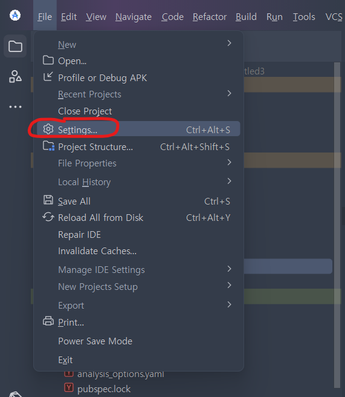
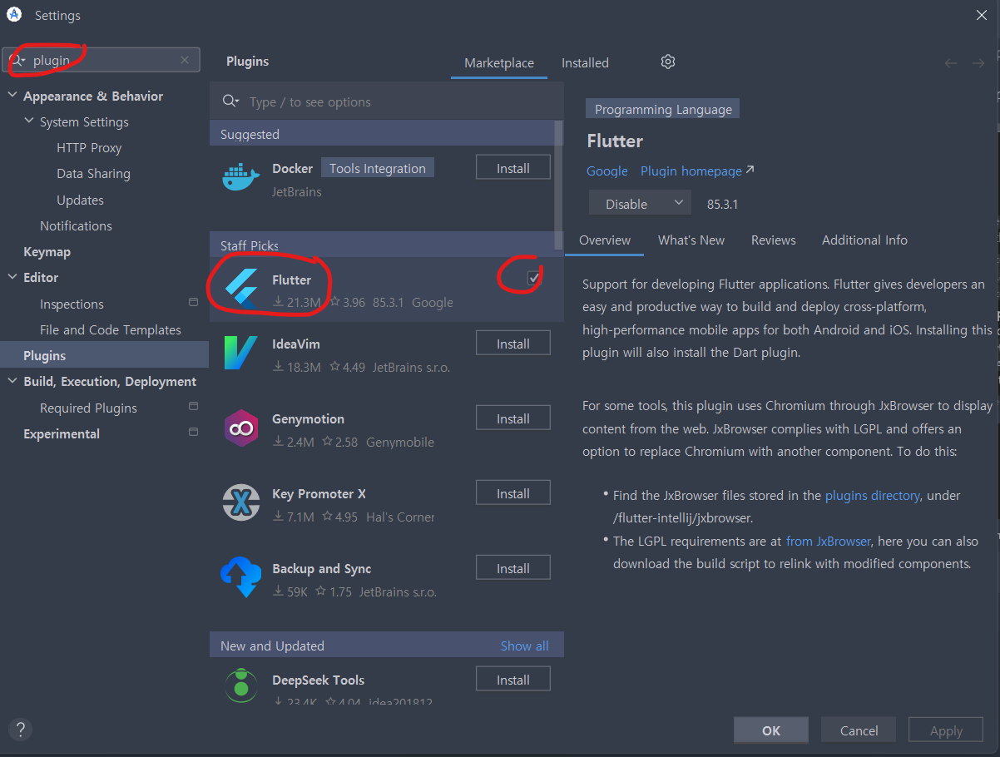
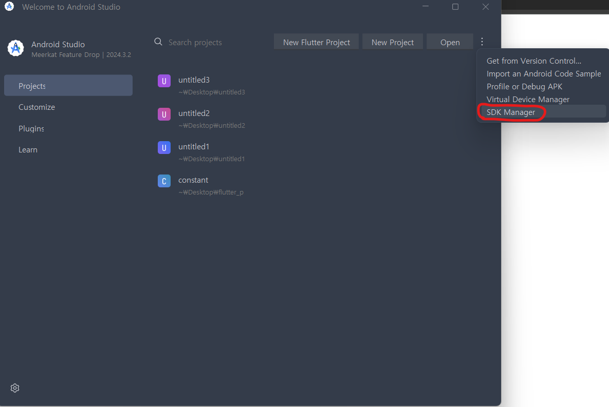
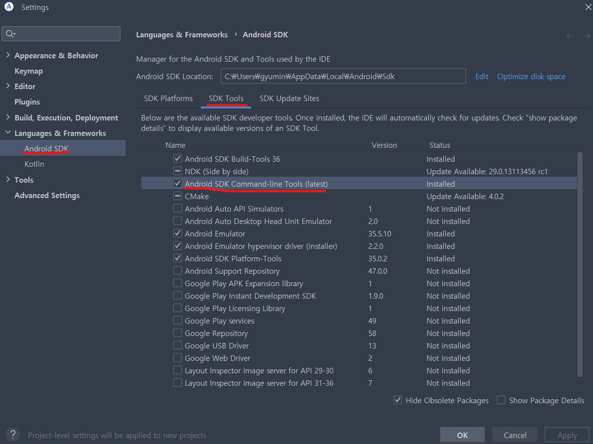
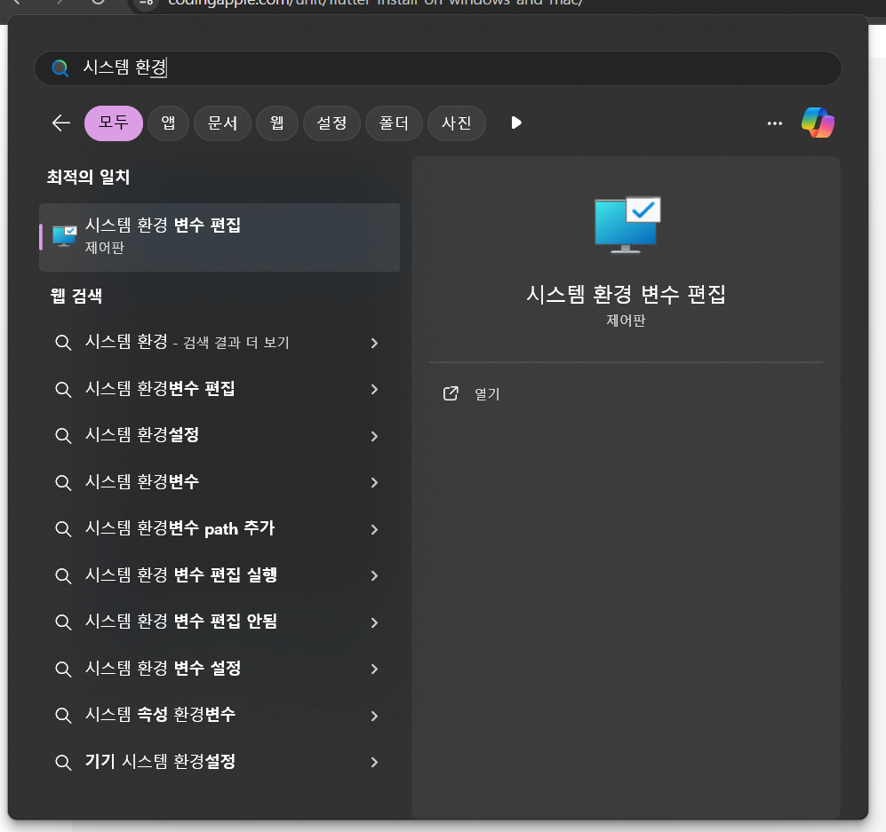
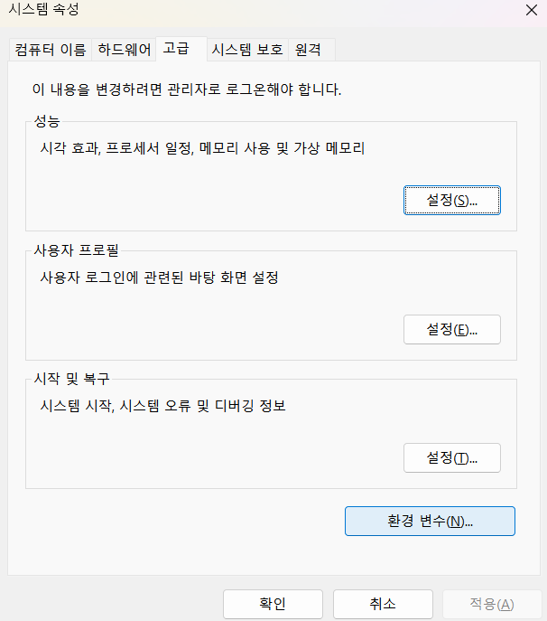
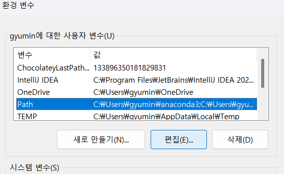
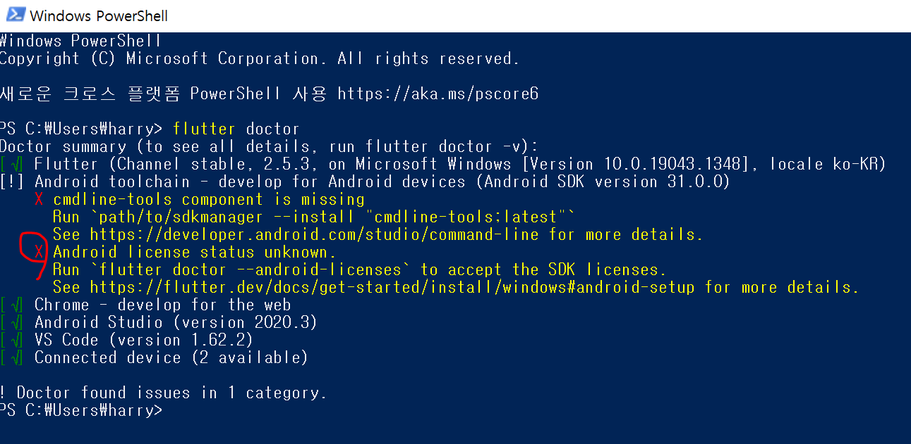

#

>⚠️ 이 블로그는 다른 사람이 보고 따라하라고 적은 게 아닌 작성자의 복기만을 위한 블로그입니다
#
플레이 스토어에 앱을 올리기 위해 3만 5천원이란 거금을 들이고 개발자 계정을 샀습니다

웹 대신 앱을 개발하는 이유는, 앱이 웹에 비해 수익을 거두는 방법이 다양하고, 

소규모 커뮤니티에서도 기능을 할 수 있다 생각하기 때문입니다. 

원래 React Native로 개발하려 했는데, react native cli는 버그가 너무 많고

expo는 디버깅이 너무 빡세서 Flutter 로 시작하게 되었습니다

해커톤 한다는 마음으로 빠르게 학습 할 생각입니다. 
#
<br>

## Flutter란 무엇인가?
#
Flutter는 구글이 개발한 크로스플랫폼 UI 프레임워크로, 하나의 코드베이스로 모바일·웹·데스크톱 앱을 네이티브 성능으로 빌드할 수 있게 해줍니다.
#
Widget기반으로 UI가 구성되어 직관적으로 구성할 수 있습니다. 
#
<br>

## Dart 언어
#
Flutter는 Dart라는 독자 언어를 사용합니다. 어려울 것 없이 JS와 비슷하기 때문에 살짝씩 다른 부분만 살펴보겠습니다. 
#
#### 1. 정적 타입과 Null Safety
#
JavaScript는 동적 타입으로 형변환이 자유롭지만 
Dart는 정적 타입으로 형변환을 막습니다
```js
// js
let name = "Alice";
name = 42;  // 에러 없이 허용됨


// Dart
String name = "Alice";
name = 42;  // 컴파일 오류: String에 int를 할당할 수 없음
```
#
또한 Dart는 Null Safety를 적용하여 파라미터가 Null이 들어오는 걸 방지합니다
#
```js
// js
function greet(msg) {
    return msg
}
greet(null) // null return


// Dart
function greet(msg) {
    return msg
}
greet(null) // 에러
```
#
Dart에서 null을 허용하기 위해서 변수 앞 ?를 붙여야 합니다
#
```js
String? maybe;  
maybe = null;  // OK
```
#
#### 2. 화살표 함수와 가변변수
#
```js
// JS: 화살표 함수, 가변 매개변수(rest)
const sum = (...nums) => nums.reduce((a, b) => a + b, 0);
console.log(sum(1,2,3));  // 6


// Dart: 화살표 함수, 가변 매개변수
int sum(List<int> nums) => nums.fold(0, (a, b) => a + b);
void main() {
  print(sum([1,2,3]));  // 6
}
```
JS는 (...nums)로 개수 제한 없는 인자를 처리.
#
Dart는 반드시 List<T> 타입으로 넘겨야 하고, 화살표 함수(=>)도 지원합니다.
#
#### 3. 클래스 기반 객체지향
#
```js
// JS: 프로토타입 기반 클래스 (ES6)
class Person {
  constructor(name) {
    this.name = name;
  }
  greet() {
    console.log(`Hi, I'm ${this.name}`);
  }
}

const p = new Person("Bob");
p.greet();  // Hi, I'm Bob


// Dart: 클래스 + 생성자 + 믹스인 예시
mixin Logger {
  void log(String msg) => print("[LOG] $msg");
}

class Person with Logger {
  final String name;
  Person(this.name);
  
  void greet() {
    log("Hi, I'm $name");  // 믹스인의 메서드 호출
  }
}

void main() {
  var p = Person("Bob");
  p.greet();  // [LOG] Hi, I'm Bob
}
```
Dart는 mixin 키워드로 mixin을 간편하게 지원합니다.
#
필드를 final로 선언해 불변성도 쉽게 확보할 수 있습니다.
#
#### 4. 비동기 처리: Future vs Promise
#
```js
// JS: Promise
function fetchValue() {
  return new Promise(resolve => {
    setTimeout(() => resolve(123), 500);
  });
}

fetchValue()
  .then(val => console.log(val))
  .catch(err => console.error(err));


// Dart: Future + async/await
Future<int> fetchValue() async {
  await Future.delayed(Duration(milliseconds: 500));
  return 123;
}

void main() async {
  try {
    final val = await fetchValue();
    print(val);
  } catch (e) {
    print(e);
  }
}
```
#
Dart의 Future와 async/await 문법은 JS와 거의 유사하지만, Duration 객체로 시간 지연을 표현합니다.
#
#### 5. 병렬 처리: Isolate 예시
#
```js
// Dart: Isolate 생성 (JS에는 이와 같은 메모리 독립 워커가 없음)
import 'dart:isolate';

void heavyTask(SendPort sendPort) {
  int result = 0;
  for (var i = 0; i < 100000000; i++) result += i;
  sendPort.send(result);
}

void main() async {
  final receivePort = ReceivePort();
  await Isolate.spawn(heavyTask, receivePort.sendPort);
  receivePort.listen((message) {
    print("Result: $message");
    receivePort.close();
  });
}
```
#
JS의 Web Worker와 유사하지만, Dart Isolate는 메모리를 공유하지 않고 메시지만 주고받아 안전한 병렬 처리를 보장합니다.
#
## 플러터 설치 방법
#
플러터를 설치해봅시다
#
#### 1. Flutter SDK 설치
#
[https://docs.flutter.dev/install/archive?tab=windows](https://docs.flutter.dev/install/archive?tab=windows)
이 링크로 들어가서 플러터 SDK zip 파일을 다운받읍시다
#
아무대나 풀면 안되고, 경로에 한글이 없는 C:/에 푸는 것이 제일 좋습니다
#
#### 2. Android Studio 설치
[https://developer.android.com/studio?hl=ko](https://developer.android.com/studio?hl=ko)
이 링크로 들어가서 Android Studio를 설치합시다
#
물흐르는대로 설치하시면 됩니다
#
#### 3. Android Studio 셋팅
#
코드짤 때 VScode 에디터 쓰고 싶어도
일단 Android Studio 셋팅은 해놓고 다른 에디터 쓰셔야합니다.
#
{: width="400px"}
#
{: width="400px"}
#
Android Studio 처음 켜면 Plugins 메뉴가 있는데
거기서 Flutter 라는 플러그인을 찾아 Install 누릅시다
#
{: width="400px"}
#
More Actions 버튼 누르면 나오는 SDK Manager 눌러봅니다.
#
{: width="400px"}
#
#### 환경변수 등록
#
{: width="400px"}
#
시스템 환경 변수를 편집해줍시다 (계정의 환경 변수 아님). 
#
{: width="400px"}
#
환경 변수 클릭
#
{: width="400px"}
#
편집 클릭
#
{: width="400px"}
#
`C:\flutter\bin`을 추가해줍니다
#
{: width="400px"}
#
잘 되었는지 테스트는 윈도우 검색메뉴 -> Powershell 검색 후 실행한 다음
#
`flutter doctor`
#
입력하고 엔터치면 쫘르륵 이상한게 뜹니다.
#
Flutter 앱개발에 필요한 요소들 설치 잘 되었는지 확인해주는 프로그램입니다.
#
이거보고 하나하나 알아서 추가해나가면 됩니다. 
#
친절하게 에러 고치는 법 알려주니까 하라는대로 하면 됩니다