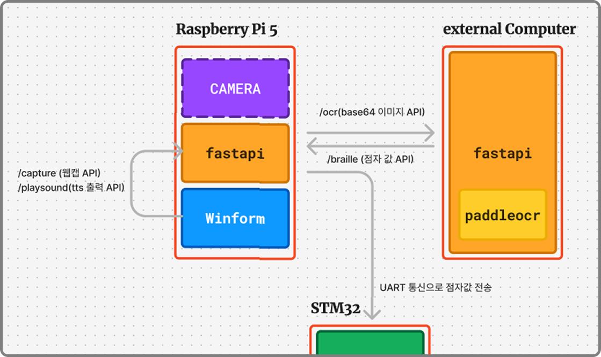
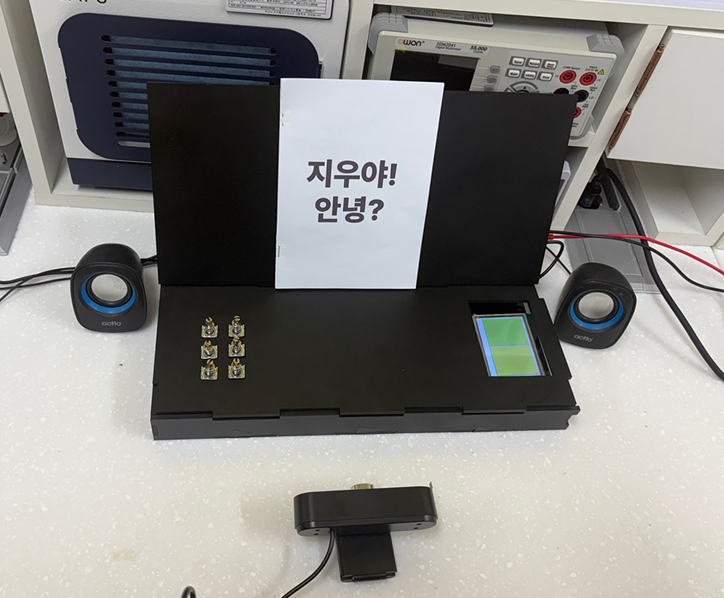
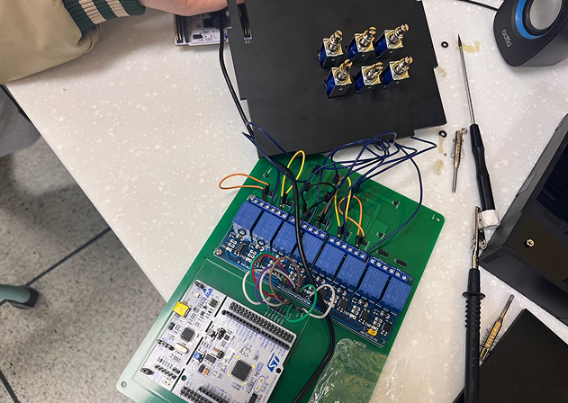
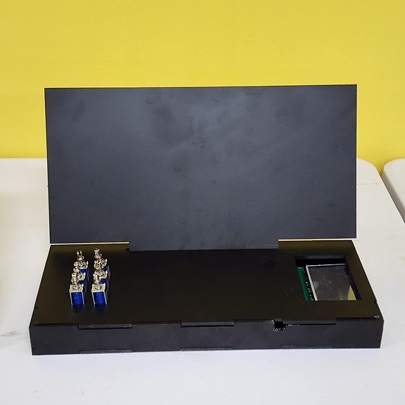

#

#

#

#
## 계기
#
시각장애인은 책이나 문서를 읽는 데 있어 많은 제약을 겪고 있습니다. 점자책은 종류가 제한적이고, 화면 읽기 프로그램도 인쇄된 문서나 손글씨를 읽는 데는 한계가 있습니다. 
이에 대해 시각장애인 분들이 더 다양한 정보를 자유롭게 접할 수 있도록 돕는 방법에 대해 고민하게 되었습니다.
기술의 발전으로 이미지에서 텍스트를 인식하고 이를 음성으로 변환하는 기술이 가능해진 만큼, 이를 활용해 일상 속에서 실제로 도움이 되는 도구를 만들고 싶었습니다. 
단순히 기술을 적용하는 것을 넘어서, 사용자 중심의 접근으로 시각장애인분들이 손쉽게 사용할 수 있는 독서대 형태의 기기를 구상하게 되었고, 이로 인해 이 프로젝트가 기획하게 되었습니다

#
##
#
[github](https://github.com/gyumingim/WESEE_BE)