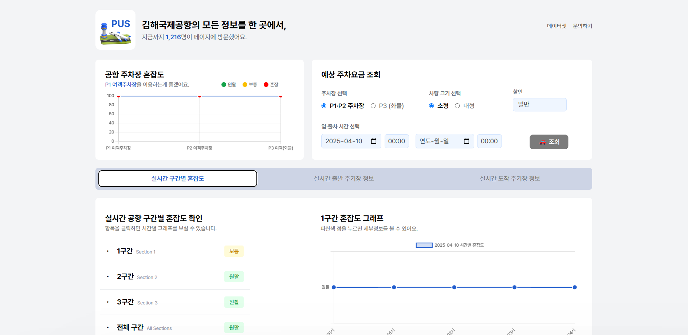
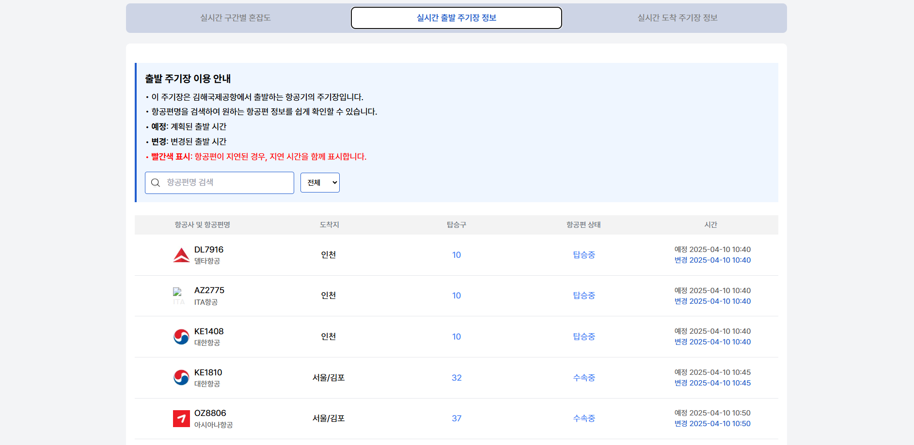

#

#

#
**[Airport-PUS](https://github.com/airport-pus/Client) (2025)**
#
### 계기
#
고등학교 2학년 겨울방학,
방학 동안 꼭 사용자가 실제로 유입할 수 있는 웹사이트를 만들어보고 싶었습니다. 
그렇게 아이디어를 찾고, 여러 공공데이터를 찾아보던 중, 우연히 서희찬 님이 개발한 ‘인천국제공항 승객 현황’ 웹사이트를 보게 됐다. 데이터를 잘 정리해서 시각적으로 보여주는 구조가 인상 깊었고, 무엇보다 상단에 사용한 공공데이터 링크를 걸어두신 것을 보고 나도 ‘공공데이터를 활용해서 무언가 만들어보자’는 아이디어를 갖게 되어, 김해국제공항의 정보를 한눈에 볼 수 있는 사이트, Airport-PUS를 기획하게 되었습니다
#
### 문제해결
#
배포에 대한 문제
#
Vercel
- GitHub 조직 무료 배포 한도 초과로 더 이상 배포 불가
Netlify
- 해외 서버로 렌더링 속도가 20초 이상으로 매우 느림
render.com
- 완전 무료 & 도메인 연결 가능했으나, 무접속 시 50초 이상 걸리는 절전 모드 진입 문제 발생
#
해결
- UptimeRobot을 이용해 5분 주기 사이트 핑(ping) → 절전 모드 방지 및 항상 빠른 응답 보장

